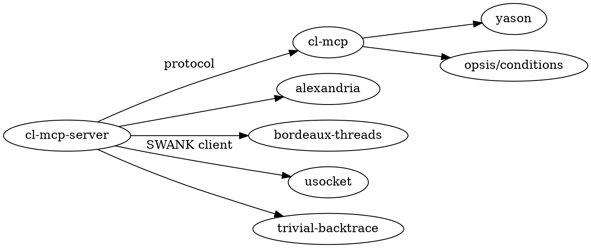

# cl-mcp-server — Dev Skill

MCP server providing 63 Common Lisp REPL tools to Claude. Thin application layer over the `cl-mcp` protocol library.

## Quick Reference

```bash
# Load
sbcl --load cl-mcp-server.asd --eval "(ql:quickload :cl-mcp-server)"

# Run
sbcl --load cl-mcp-server.asd \
     --eval "(ql:quickload :cl-mcp-server)" \
     --eval "(cl-mcp-server:start)"

# Test
sbcl --load cl-mcp-server.asd \
     --eval "(ql:quickload :cl-mcp-server/tests)" \
     --eval "(asdf:test-system :cl-mcp-server)"
```

## Architecture

**Dependency graph**:



**What cl-mcp owns**: JSON-RPC 2.0 framing, stdio transport, MCP handshake, per-server tool registry, error recovery.

**What cl-mcp-server owns**: Session state, code evaluation, 63 REPL tool handlers.

`start` reduces to 3 calls:
```lisp
(cl-mcp:make-server :name "cl-mcp-server" :version "0.4.2")
(cl-mcp-server.tools:define-builtin-tools server session)
(cl-mcp:run-server server)
```

## Package Structure

| Package | File | Purpose |
|---------|------|---------|
| `cl-mcp-server.conditions` | `src/conditions.lisp` | REPL conditions + re-exports from `cl-mcp.conditions` |
| `cl-mcp-server.error-format` | `src/error-format.lisp` | Condition/backtrace formatting |
| `cl-mcp-server.session` | `src/session.lisp` | Persistent `*package*` context and state |
| `cl-mcp-server.evaluator` | `src/evaluator.lisp` | Safe evaluation with stream capture |
| `cl-mcp-server.introspection` | `src/introspection.lisp` | Symbol/class/method inspection |
| `cl-mcp-server.asdf-tools` | `src/asdf-tools.lisp` | ASDF/Quicklisp operations |
| `cl-mcp-server.profiling-tools` | `src/profiling-tools.lisp` | Statistical and deterministic profiling |
| `cl-mcp-server.telos-tools` | `src/telos-tools.lisp` | Telos intent introspection (graceful degradation; see RULE-007) |
| `cl-mcp-server.tools` | `src/tools.lisp` | Registers all 63 tools via `cl-mcp:register-tool` |
| `cl-mcp-server` | `src/server.lisp` | Entry point: `start` |

## File Layout

| Path | Purpose |
|------|---------|
| `cl-mcp-server.asd` | ASDF system (depends on `cl-mcp`) |
| `src/` | Implementation |
| `tests/` | FiveAM test suites |
| `docs/` | User and contributor docs |
| `run-server.lisp` | Script entry point |
| `../cl-mcp/` | External protocol library |

## Critical Rules

### RULE-001: Request-Response Guarantee
Every valid JSON-RPC request MUST receive exactly one response. Handled by `cl-mcp`; tool handlers MUST NOT raise uncaught conditions.

### RULE-002: Server Stability
Server MUST NOT terminate due to evaluation errors. `cl-mcp` catches handler errors. Do not add `sb-ext:exit` or `error` to the server loop.

### RULE-003: Session State Persistence
Definitions made in one evaluation MUST be available in subsequent evaluations. Always use `with-session` to bind `*session*`.

### RULE-004: Output Stream Separation
Return values, stdout, stderr, and warnings MUST be distinguishable in results. Use `format-result` from `cl-mcp-server.evaluator`.

### RULE-005: Condition Type Preservation
Error responses MUST include condition type, not just message:
```lisp
(format nil "[ERROR] ~A~%~A" (type-of condition) condition)
```

### RULE-006: Tool Registration via cl-mcp
New tools MUST be registered via `cl-mcp:register-tool` in `src/tools.lisp`. Do NOT add MCP protocol methods directly.

### RULE-007: Never Report a Swallowed Failure as an Empty Result
A tool MUST NOT convert "I could not find out" into "there is nothing there".

`(handler-case (foo) (error () nil))` around a query is how a tool learns to
lie: the caller sees an empty-but-confident answer and goes hunting for the
wrong bug. Wrapping a query MUST preserve the distinction:

```lisp
(handler-case (values (apply sym args) :ok)
  (error (condition) (values nil condition)))
```

Callers MUST inspect the status and report a failure as its own outcome. This
applies per field, not just per call — a struct accessor that fails must not
render as an absent field. See `src/telos-tools.lisp`, where `telos-call` /
`telos-failure` implement this and the `:error` status carries it out.

Note the tension with RULE-001: handlers must not raise, which tempts a blanket
`handler-case`. Catch the condition, then *report* it — do not discard it.

## Coding Conventions

- **80 columns, hard.** Code, comments, docstrings and strings alike.
  `python3 tools/check-line-length.py src/*.lisp tests/*.lisp *.asd` must
  report 0. To wrap a long string without changing it, use FORMAT's
  `~<newline>` continuation — it eats the newline *and the following
  indentation*, so never break immediately before text whose leading spaces
  matter, and double any literal `~`. A bare (non-FORMAT) string literal
  cannot use it; split with `concatenate` instead.
- Spaces only, never tabs
- Every file begins with `;;; ABOUTME: ...` comment
- Naming: `*earmuffs*` for specials, `+plus+` for constants, `-p` predicates, `make-` constructors
- Package names: lowercase hyphenated (`cl-mcp-server.evaluator`)
- Error handling: `handler-case` for expected errors, `handler-bind` for warnings (muffle)

## Testing

Test helpers in `tests/packages.lisp`:
```lisp
;; Create a test server with all tools
(multiple-value-bind (server session) (make-test-server)
  ;; Call a tool
  (call-test-tool server "evaluate-lisp" '(("code" . "(+ 1 2)"))))
```

Test suites: `error-format-tests`, `session-tests`, `evaluator-tests`, `tools-tests`,
`introspection-tests`, `asdf-tools-tests`, `profiling-tools-tests`, `paren-tools-tests`,
`file-tools-tests`, `hyperspec-tests`, `quicklisp-tools-tests`, `telos-tools-tests`,
`remote-config-tests`, `remote-tests`, `remote-inspect-tests`, `integration-tests`.

### Two test systems, and why

| System | Depends on | Files |
|--------|-----------|-------|
| `cl-mcp-server/tests` | `cl-mcp-server`, `fiveam` | the 15 core files |
| `cl-mcp-server/tests-telos` | `cl-mcp-server/tests`, `telos` | `telos-fixture`, `telos-tools-tests` |

`asdf:test-system :cl-mcp-server` runs both when telos is installed and the
core suite alone when it is not, printing a line saying the telos suites were
skipped. The choice is made when the `.asd` is *read*, so the telos suites
are a real `:in-order-to` dependency rather than a load inside `perform` —
ASDF deprecates the latter as recursive `OPERATE`.

Expect roughly these counts:

- core suite alone, telos absent — **1181 checks**
- `run!` on `cl-mcp-server-tests` with telos — **1288 checks**
- `asdf:test-system` (which uses `run-all-tests`, so it also sweeps suites
  outside that parent, such as `timeout-tests`) — **~1320 checks**

The last number is not stable to the digit: `run-all-tests` visits every
registered suite, and a few of them measure ambient image state such as how
many ASDF systems are loaded. Treat a *failure* as signal, not a count that
moved by a handful.

**Why the split.** Telos used to be a plain `:depends-on` of the single test
system, so a machine without it could not load the tests at all — 0 checks
ran rather than 1181. See issue #1.

**Why the fixture still uses real telos.** Telos keys its registries by
symbols interned in each feature's *own defining package*, and a mock would
drift from that shape exactly as the wrapper once did — which is the bug the
suite exists to prevent. `tests/telos-fixture.lisp` defines real features in
throwaway packages the resolver cannot guess, so any regression to
intern-based lookup fails loudly instead of passing by accident.

**One trap when running tests in a live image**: `timeout-tests` asserts the
shipped default of `*evaluation-timeout*` (30). If a session has called
`configure-limits {"timeout": N}`, that test fails until the default is
restored. It is correct in a fresh image; it is fragile in a REPL you have
been working in.

## Key Invariants

1. **INV-001**: Every valid JSON-RPC request → exactly one response
2. **INV-002**: Server never terminates due to evaluation errors
3. **INV-003**: Session state persists across evaluations
4. **INV-004**: Output streams (stdout/stderr/values) are distinguishable
5. **INV-005**: All messages conform to JSON-RPC 2.0
6. **INV-006**: Condition types are preserved in error reports
7. **INV-007**: A failed query is never reported as an empty result (RULE-007)

## Interactive Development

When Lisp MCP tools are available (`mcp__lisp__evaluate-lisp`):
- Load system once: `(ql:quickload :cl-mcp-server)`
- Redefine functions interactively, test, then write to file
- Reload system after package/export changes

## References

- **Protocol specs**: `docs/reference/mcp-protocol.md` → wire protocol and dispatch
- **Architecture**: `docs/explanation/architecture.md`
- **cl-mcp API**: `../cl-mcp/CLAUDE.md`
- **Tool catalog**: `.claude/skills/integration/references/tools-reference.md`
